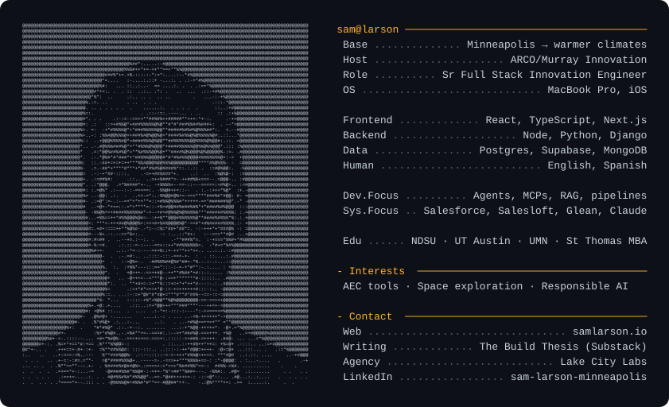

  

### 60-second bio

- 🌲 Born and raised in Minnesota.
- 🏗️ I build full-stack web tools for construction. Fast React front-ends and the data pipelines that feed them.
- 🤖 Lately: agentic workflows for real industry problems. Standing up coding agents, building custom MCP tooling, wiring AI into CRMs, and shaping data lakes so front-end users can work with data agentically. Examples at [samlarson.io/work](https://samlarson.io/work).
- ✍️ I write [The Build Thesis](https://substack.com/@samlarson), a newsletter on applied AI in construction, and run [Lake City Labs](https://www.lakecitylabs.com), an AI consulting practice.
- 🤝 Open to collaborating on open source that benefits the AEC and real estate industries, the planet, or healthier living.

### Stack

  

**Data & ML**

  
  &nbsp;
  
  &nbsp;
  

### Find me

🌐 [samlarson.io](https://www.samlarson.io) · ✍️ [The Build Thesis](https://substack.com/@samlarson) · 🏗️ [Lake City Labs](https://www.lakecitylabs.com) · 💼 [LinkedIn](https://www.linkedin.com/in/sam-larson-minneapolis/)
